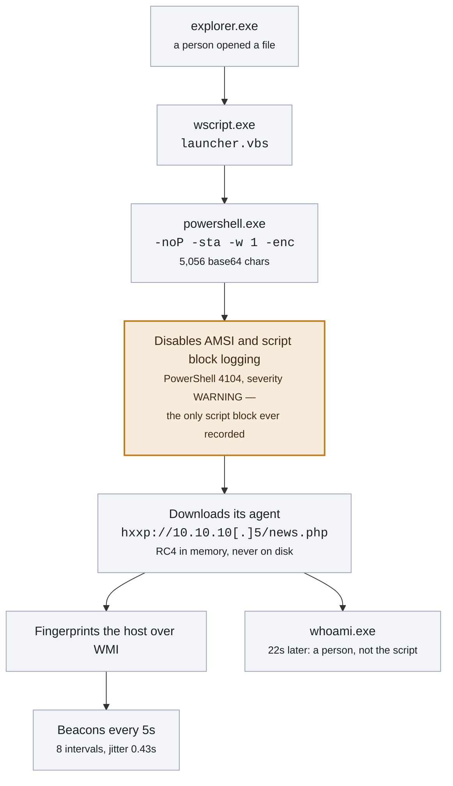
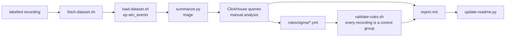

# Endpoint Detection (Windows telemetry)

Detections written from public recordings of real attack techniques on Windows. Sysmon and Windows Event Log data is
loaded into ClickHouse, analysed, and turned into **Sigma rules that are validated against every recording in the
repository** — the ones they must catch, and the ones where they must stay silent.

This is the endpoint half of a pair. The [network project](https://github.com/junting9817/malware-traffic-analysis)
analyses malicious traffic captures and writes Suricata rules; the coverage table below shows where the two meet.

### The case the rules came from

An Empire VBS launcher, from double-click to beacon in 29 seconds. Amber is the moment worth detecting: the stager's
attempt to disable AMSI and script block logging is itself logged, and it is the last script block the host recorded.



**What the rules key on** is the shape, not this campaign: a script host handing over to PowerShell, an encoded
command line, and a script block naming the AMSI or logging fields it has to reference. The C2 address is base64
*inside* the base64 command, so searching command lines for it finds nothing.

<!-- ep:stats -->
| | |
|---|---|
| Techniques analysed | 1 published |
| Sigma rules | 4 in the library · 4 validated · 0 false-positive candidates |
| ATT&CK techniques | 5 tagged · 5 covered by a validated rule |
| Rule validation | **PASSED** — 4 expectations met, 0 failed, over 2 recordings ([rules/validation.txt](rules/validation.txt)) |
<!-- /ep:stats -->

## Analyses

<!-- ep:analyses -->
| Date | Analysis | Technique | Recording | Rules | ATT&CK |
|---|---|---|---|---|---|
| 2026-09-16 | [Empire VBS launcher — a desktop script that blinds PowerShell, then beacons](analyses/2026-09-16-empire-launcher-vbs/report.md) | Empire launcher (VBS stager) | `empire_launcher_vbs` (2067 events) | `script-host-spawns-powershell`, `encoded-powershell-command`, `powershell-amsi-and-logging-tamper` | [T1204.002](https://attack.mitre.org/techniques/T1204/002/), [T1059.005](https://attack.mitre.org/techniques/T1059/005/), [T1059.001](https://attack.mitre.org/techniques/T1059/001/), [T1027](https://attack.mitre.org/techniques/T1027/), [T1140](https://attack.mitre.org/techniques/T1140/), [T1562.001](https://attack.mitre.org/techniques/T1562/001/), [T1105](https://attack.mitre.org/techniques/T1105/), [T1071.001](https://attack.mitre.org/techniques/T1071/001/), [T1016](https://attack.mitre.org/techniques/T1016/), [T1033](https://attack.mitre.org/techniques/T1033/), [T1082](https://attack.mitre.org/techniques/T1082/) |
<!-- /ep:analyses -->

## Rule library

Written in [Sigma](https://sigmahq.io/), so the same rule converts to Splunk, Elastic or Sentinel with `sigma-cli`.
Each rule's intent, logic, false-positive notes and **evasion notes** are in [rules/README.md](rules/README.md).

<!-- ep:rules -->
| Rule | Title | ATT&CK | Level | Validation |
|---|---|---|---|---|
| `encoded-powershell-command` | PowerShell started with an encoded command | [T1027](https://attack.mitre.org/techniques/T1027/), [T1059.001](https://attack.mitre.org/techniques/T1059/001/) | high | fires where expected, silent elsewhere |
| `lsass-memory-read-access` | LSASS opened with memory read access | [T1003.001](https://attack.mitre.org/techniques/T1003/001/) | high | fires where expected, silent elsewhere |
| `powershell-amsi-and-logging-tamper` | PowerShell script block tampering with AMSI or script block logging | [T1059.001](https://attack.mitre.org/techniques/T1059/001/), [T1562.001](https://attack.mitre.org/techniques/T1562/001/) | high | fires where expected, silent elsewhere |
| `script-host-spawns-powershell` | Script host starts PowerShell | [T1059.001](https://attack.mitre.org/techniques/T1059/001/), [T1059.005](https://attack.mitre.org/techniques/T1059/005/) | high | fires where expected, silent elsewhere |
<!-- /ep:rules -->

Validation lives in [rules/expected.yaml](rules/expected.yaml) (what each rule must catch, per recording) and
[rules/validation.txt](rules/validation.txt) (the last result).

## ATT&CK coverage, endpoint and network

<!-- ep:coverage -->
| Technique | Endpoint | Network |
|---|---|---|
| [T1003.001](https://attack.mitre.org/techniques/T1003/001/) | validated rule | — |
| [T1016](https://attack.mitre.org/techniques/T1016/) | analysed, no rule | — |
| [T1027](https://attack.mitre.org/techniques/T1027/) | validated rule | — |
| [T1033](https://attack.mitre.org/techniques/T1033/) | analysed, no rule | — |
| [T1041](https://attack.mitre.org/techniques/T1041/) | — | validated rule |
| [T1056.001](https://attack.mitre.org/techniques/T1056/001/) | — | seen in traffic |
| [T1059.001](https://attack.mitre.org/techniques/T1059/001/) | validated rule | — |
| [T1059.005](https://attack.mitre.org/techniques/T1059/005/) | validated rule | — |
| [T1071.001](https://attack.mitre.org/techniques/T1071/001/) | analysed, no rule | validated rule |
| [T1082](https://attack.mitre.org/techniques/T1082/) | analysed, no rule | — |
| [T1095](https://attack.mitre.org/techniques/T1095/) | — | validated rule |
| [T1105](https://attack.mitre.org/techniques/T1105/) | analysed, no rule | validated rule |
| [T1140](https://attack.mitre.org/techniques/T1140/) | analysed, no rule | — |
| [T1204.002](https://attack.mitre.org/techniques/T1204/002/) | analysed, no rule | — |
| [T1204.004](https://attack.mitre.org/techniques/T1204/004/) | — | validated rule |
| [T1562.001](https://attack.mitre.org/techniques/T1562/001/) | validated rule | — |
| [T1571](https://attack.mitre.org/techniques/T1571/) | — | seen in traffic |
| [T1572](https://attack.mitre.org/techniques/T1572/) | — | seen in traffic |

0 techniques are covered on both sides, 5 on the endpoint only, 5 on the network only.
<!-- /ep:coverage -->

Navigator layers: [endpoint](rules/attack-coverage.json), [combined](rules/attack-coverage-combined.json).

## How a technique is analysed



The checklist is in [docs/workflow.md](docs/workflow.md); every write-up follows [TEMPLATE.md](TEMPLATE.md), and what
each case changed is in [docs/lessons.md](docs/lessons.md).

| Script | What it does |
|---|---|
| [`fetch-dataset.sh`](scripts/fetch-dataset.sh) | Downloads a recording, checks the archive, records both hashes |
| [`load-dataset.sh`](scripts/load-dataset.sh) | Maps events into `ep.win_events`; one partition per recording, so a reload replaces it |
| [`summarize.py`](scripts/summarize.py) | Triage: process tree, rare parent-child pairs, LOLBins, network per process, persistence, LSASS access |
| [`sigma-to-sql.py`](scripts/sigma-to-sql.py) | Converts a Sigma rule to ClickHouse SQL and runs it while you write |
| [`validate-rules.sh`](scripts/validate-rules.sh) | Lints, runs every rule over every recording, reports false-positive candidates |
| [`update-readme.py`](scripts/update-readme.py) | Regenerates the tables above and the ATT&CK layers |

## Safety

Every dataset is a recording made in someone else's lab: nothing is executed here, no Windows host is involved, and no
attack tool is downloaded or run. Recordings stay on the data disk and never enter this repository — a pre-commit hook
refuses EVTX files, archives and binaries by inspecting their content.

## Reproducing a case

```bash
scripts/apply-schema.sh                                              # once: create the ep database
scripts/new-case.sh 2026-09-20-empire-launcher-vbs
scripts/fetch-dataset.sh atomic/windows/execution/host/empire_launcher_vbs.zip
scripts/load-dataset.sh empire_launcher_vbs 2026-09-20-empire-launcher-vbs
scripts/summarize.py 2026-09-20-empire-launcher-vbs                  # where to look
# write rules/sigma/<rule>.yml, then:
scripts/validate-rules.sh
scripts/update-readme.py
```

ClickHouse runs in the network lab's container; this project only ever writes its own `ep` database.

## Repository layout

```
analyses/<case>/   report.md, dataset.txt, triage.txt, findings.csv, queries.sql
rules/             sigma/*.yml + README.md, expected.yaml, validation.txt, attack-coverage*.json
schema/            ClickHouse DDL for the ep database
scripts/           the pipeline above, with shared helpers in scripts/lib/
datasets/          recordings — git-ignored, on the data disk
```
